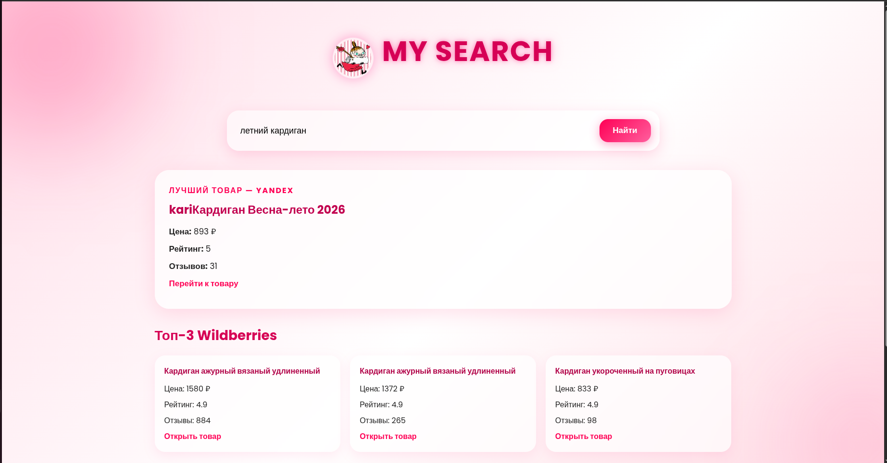
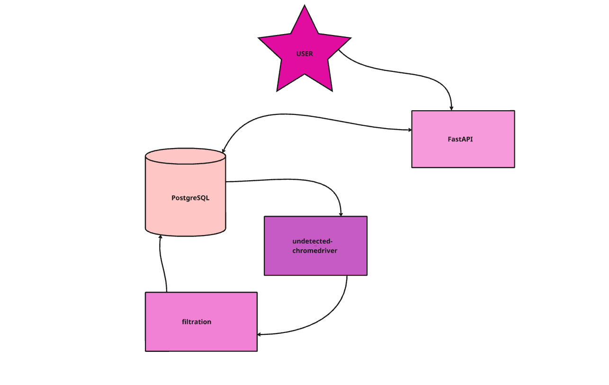

# Marketplace Analyzer "MY SEARCH"

Приложение для анализа и поиска товаров на российских маркетплейсах (Wildberries, Яндекс.Маркет) с кэшированием результатов и автоматической очисткой устаревших данных.

## Функциональность

- **Поиск товаров** на Wildberries и Яндекс.Маркет
- **Фильтрация** по рейтингу и количеству отзывов
- **Кэширование результатов** в PostgreSQL
- **Автоматическая очистка кэша** по TTL
- **REST API**
- **Web интерфейс** для удобного использования

##  Технический стек

- **Web Framework:** FastAPI, Uvicorn — асинхронный веб-сервер с автодокументацией
- **Database:** PostgreSQL — основная БД, asyncpg, psycopg2-binary — драйверы для синхронных и асинхронных операций
- **ORM & Migrations:** SQLAlchemy — ORM для работы с БД, Alembic — версионирование схемы и миграции
- **Web Scraping:** undetected-chromedriver, Selenium — браузер автоматизация, BeautifulSoup4 — парсинг HTML
- **Background Tasks:** APScheduler — планировщик для автоматической очистки кэша

## Требования

- Python 3.10+
- PostgreSQL 12+
- Chrome/Chromium (для веб-скрейпинга)

## Установка

```bash
git clone <repo-url>
cd TermPaperWB
python3.10 -m venv venv
source venv/bin/activate  # Linux/Mac
venv\Scripts\activate  # Windows
pip install -r requirements.txt
```
Создаем .env и копируем данные с .env.example
```bash
cp .env.example .env
alembic upgrade head
uvicorn main:app --reload
```
Приложение будет доступно на `http://localhost:8000`

## Лицензия

NPOSL-3.0



